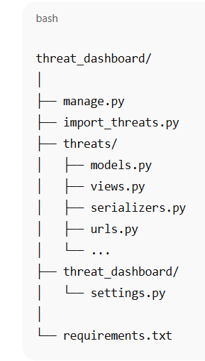

# 🛡️ Threat Intelligence Dashboard

A full-stack cybersecurity dashboard that ingests NLP-based threat data from a CSV and exposes a REST API for filtering, searching, and visualizing cyber threats.

---

## 🧰 Tech Stack

**Backend:** Django + Django REST Framework  
**Database:** PostgreSQL  
**Frontend:** (Optional) React  
**Data Source:** [Kaggle NLP Cyber Threat Dataset](https://www.kaggle.com/datasets/hussainsheikh03/nlp-based-cyber-security-dataset)

---

## 🚀 Features

- Upload & store CSV-based threat data
- Filter by Threat Category
- Full-text search on threat description
- Get summary statistics (category & severity)
- Extensible architecture for future ML/visualizations

---

## ⚙️ Installation & Setup

### 1. Clone the repository

```bash
git clone https://github.com/yourusername/threat-dashboard.git
cd threat-dashboard


```
4. Set up PostgreSQL
Make sure PostgreSQL is installed and running.

sql
Copy
Edit
CREATE DATABASE threat_db;
CREATE USER your_user WITH PASSWORD 'your_password';
GRANT ALL PRIVILEGES ON DATABASE threat_db TO your_user;
Update threat_dashboard/settings.py:



DATABASES = {
    'default': {
        'ENGINE': 'django.db.backends.postgresql',
        'NAME': 'threat_db',
        'USER': 'your_user',
        'PASSWORD': 'your_password',
        'HOST': 'localhost',
        'PORT': '5432',
    }
}

🔗 API Endpoints
Method	Endpoint	Description
GET	/api/threats	List threats (pagination, filter, search)
GET	/api/threats/:id	Retrieve single threat
GET	/api/threats/stats	Dataset statistics (counts by category, etc)

```bash
python manage.py makemigrations
python manage.py migrate
python import_threats.py
```